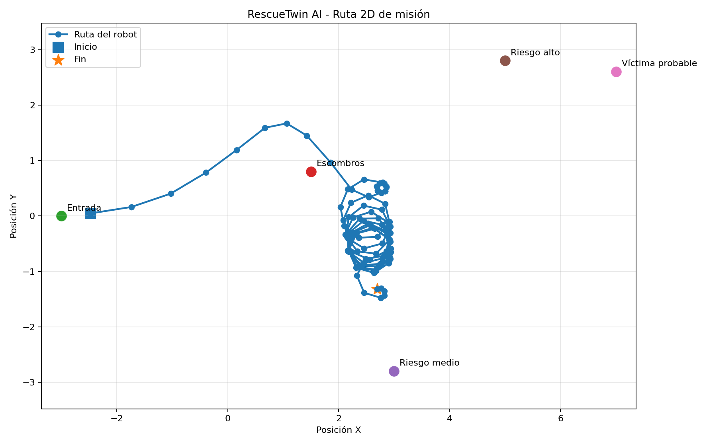
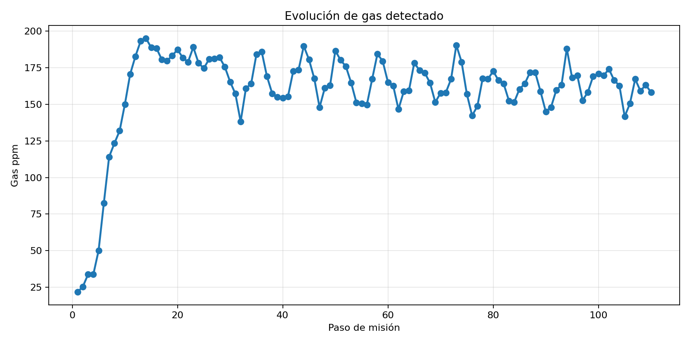
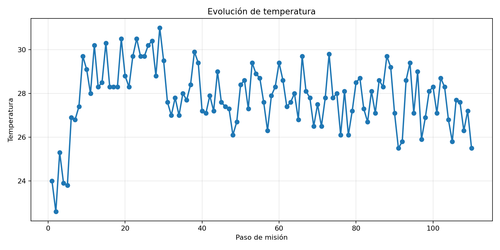
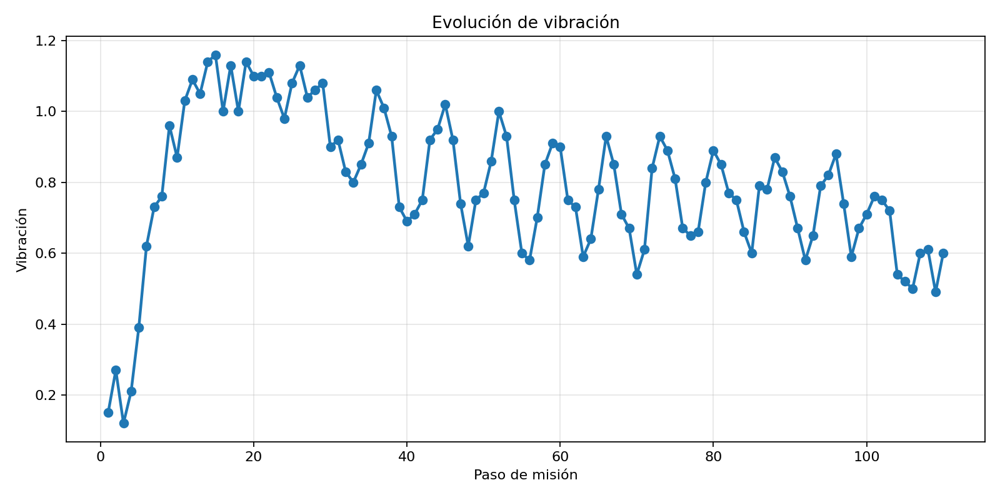
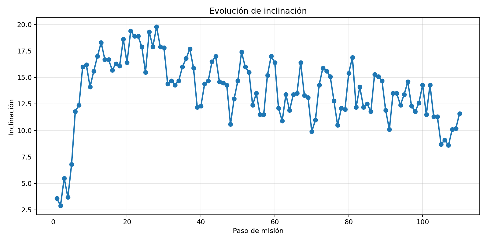
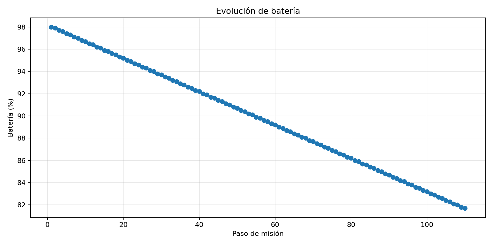
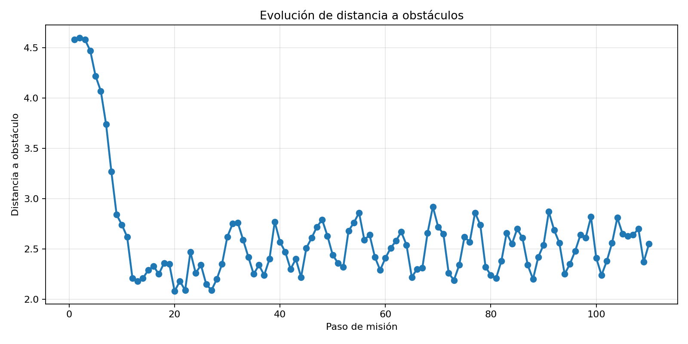
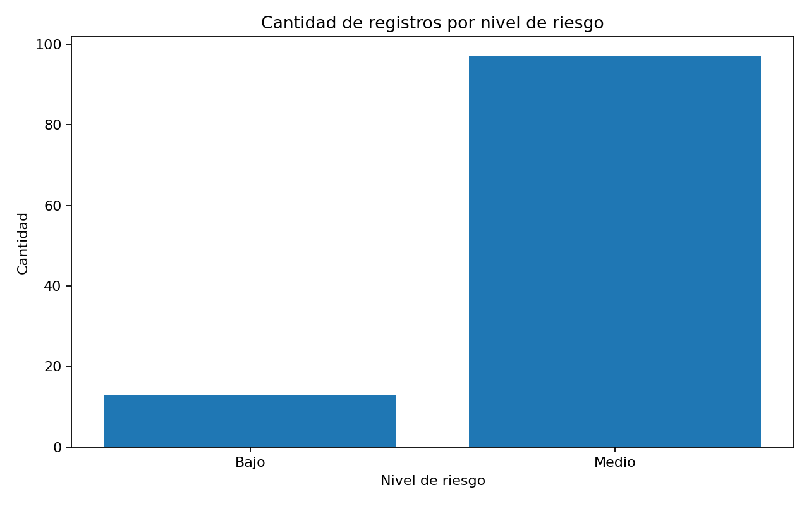
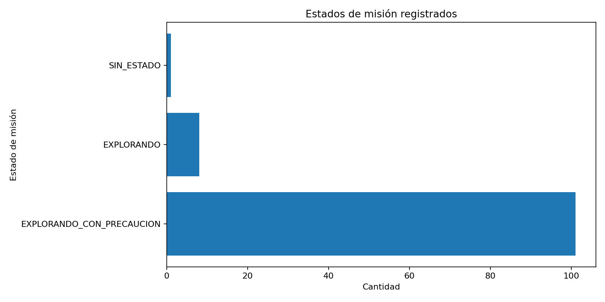

# RescueTwin AI - Reporte de misión

Fecha de generación: `2026-06-11 14:53:52`

## 1. Resumen ejecutivo

La misión simula el comportamiento de un robot cuadrúpedo de rescate en un entorno de derrumbe. Durante la ejecución, el sistema registra la posición del robot, sensores ambientales, nivel de riesgo estimado por IA, decisiones autónomas y alertas enviadas a la base.

| Métrica | Valor |
|---|---|
| Archivo CSV analizado | `/Users/nicom7910/Downloads/RescueTwin-AI/reports/mission_logs/ros_mission_20260611_141624.csv` |
| Registros analizados | 110 |
| Distancia estimada recorrida | 33.83 m |
| Riesgo máximo detectado | Medio |
| Riesgo final | Medio |
| Estado final de misión | EXPLORANDO_CON_PRECAUCION |
| Acción final recomendada | Avanzar con precaucion |
| Batería final | 81.7 % |
| Gas final | 158.2 ppm |
| Temperatura final | 25.5 °C |
| Vibración final | 0.6 |
| Inclinación final | 11.6 ° |
| Distancia final a obstáculo | 2.55 m |
| Persona detectada | No |
| Alertas registradas | 3 |

## 2. Alertas enviadas a la base

- ALERTA BASE #2 | estado=EXPLORANDO | x=-1.88, y=0.13 | Waypoint alcanzado. Nuevo objetivo: Zona de escombros inicial
- ALERTA BASE #3 | estado=EXPLORANDO | x=1.35, y=1.53 | Waypoint alcanzado. Nuevo objetivo: Cruce inestable
- ALERTA BASE #4 | estado=EXPLORANDO_CON_PRECAUCION | x=2.83, y=0.58 | Waypoint alcanzado. Nuevo objetivo: Borde de zona crítica

## 3. Gráficos generados

## 4. Últimos registros de la misión

| timestamp           |      x |       y | mission_state             | risk_level   |   temperature |   gas_ppm |   vibration |   inclination |   battery |   obstacle_distance |   person_detected |
|:--------------------|-------:|--------:|:--------------------------|:-------------|--------------:|----------:|------------:|--------------:|----------:|--------------------:|------------------:|
| 2026-06-11T14:18:05 | 2.9037 | -0.7744 | EXPLORANDO_CON_PRECAUCION | Medio        |          27.1 |     169.6 |        0.76 |          11.5 |      83   |                2.24 |                 0 |
| 2026-06-11T14:18:06 | 2.82   | -0.715  | EXPLORANDO_CON_PRECAUCION | Medio        |          28.7 |     174.1 |        0.75 |          14.3 |      82.9 |                2.38 |                 0 |
| 2026-06-11T14:18:07 | 2.4869 | -0.7753 | EXPLORANDO_CON_PRECAUCION | Medio        |          28.3 |     166.4 |        0.72 |          11.3 |      82.7 |                2.56 |                 0 |
| 2026-06-11T14:18:08 | 2.3272 | -1.0736 | EXPLORANDO_CON_PRECAUCION | Medio        |          26.8 |     162.7 |        0.54 |          11.3 |      82.6 |                2.81 |                 0 |
| 2026-06-11T14:18:09 | 2.4615 | -1.3842 | EXPLORANDO_CON_PRECAUCION | Medio        |          25.8 |     141.7 |        0.52 |           8.7 |      82.4 |                2.65 |                 0 |
| 2026-06-11T14:18:10 | 2.7616 | -1.4758 | EXPLORANDO_CON_PRECAUCION | Medio        |          27.7 |     150.5 |        0.5  |           9.1 |      82.3 |                2.63 |                 0 |
| 2026-06-11T14:18:11 | 2.8238 | -1.4298 | EXPLORANDO_CON_PRECAUCION | Medio        |          27.6 |     167.2 |        0.6  |           8.6 |      82.1 |                2.64 |                 0 |
| 2026-06-11T14:18:12 | 2.8264 | -1.3525 | EXPLORANDO_CON_PRECAUCION | Medio        |          26.3 |     159.1 |        0.61 |          10.1 |      82   |                2.7  |                 0 |
| 2026-06-11T14:18:13 | 2.7674 | -1.3024 | EXPLORANDO_CON_PRECAUCION | Medio        |          27.2 |     163.3 |        0.49 |          10.2 |      81.8 |                2.37 |                 0 |
| 2026-06-11T14:18:14 | 2.6915 | -1.3175 | EXPLORANDO_CON_PRECAUCION | Medio        |          25.5 |     158.2 |        0.6  |          11.6 |      81.7 |                2.55 |                 0 |

## 5. Interpretación

El reporte permite analizar si el robot atravesó zonas peligrosas, si el modelo IA detectó un aumento en el nivel de riesgo y si el sistema autónomo reaccionó con decisiones de navegación o alertas. La ruta 2D permite visualizar el desplazamiento del robot en el escenario, mientras que las series temporales muestran cómo evolucionaron las variables críticas de la misión.
